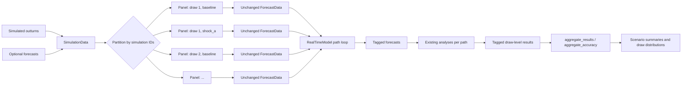
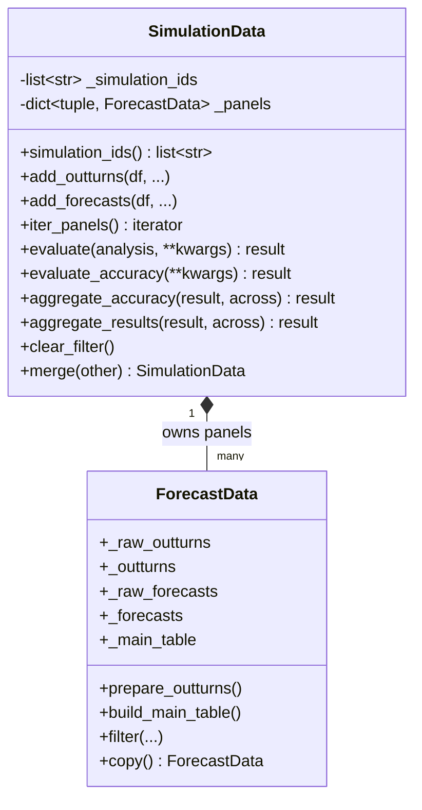
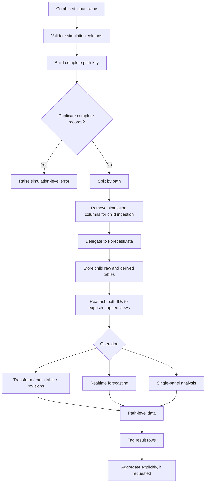
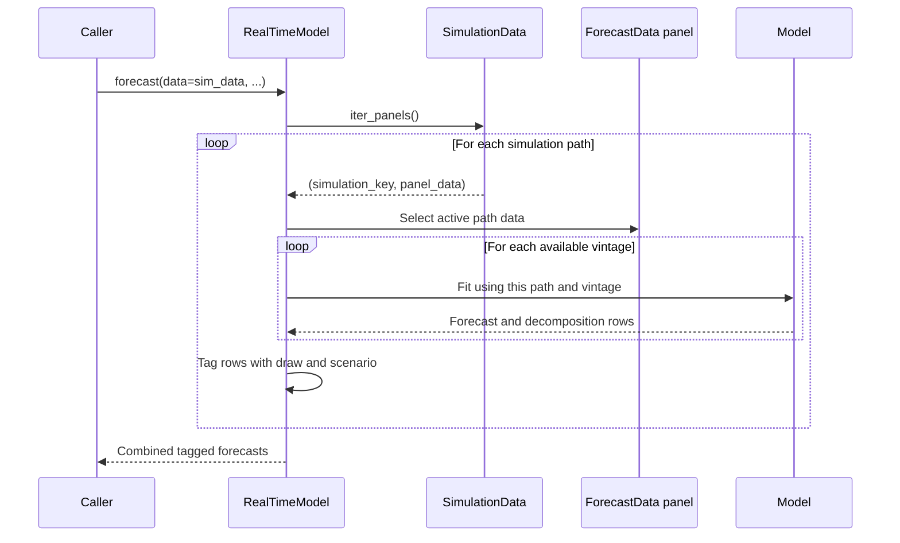
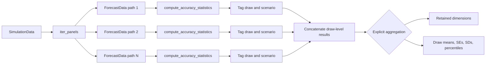
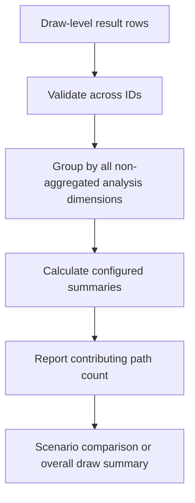
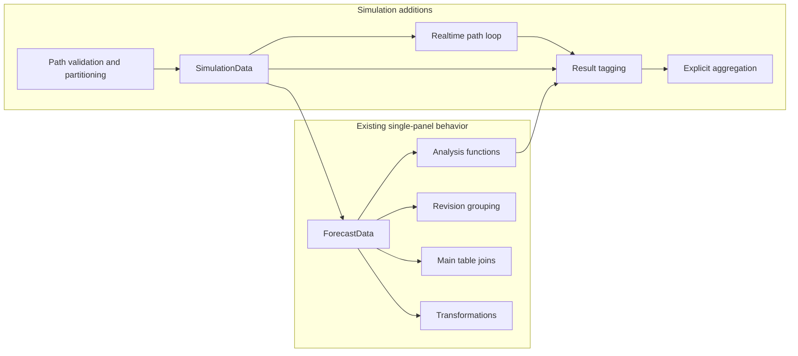
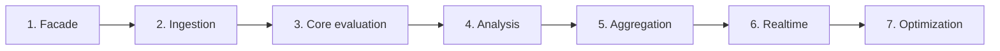
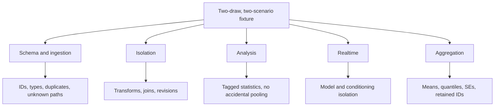

# Simulation Architecture Update

**Status:** Proposed architecture
**Source:** [SIMULATION_DESIGN.md](SIMULATION_DESIGN.md)

## Purpose

This document turns the simulation design into an implementation-shaped picture. It
is intended to help contributors see where simulation concerns live, how data moves
through the system, and where existing single-panel behavior remains untouched.

The governing rule is:

> Evaluate every simulation path independently; aggregate only after evaluation.

A simulation path is one combination of the configured simulation identifiers. With
the default configuration, a path is `(draw, scenario)`.

## 1. System At A Glance



### Boundary summary

| Component | Owns | Does not own |
|---|---|---|
| `ForecastData` | One-panel validation, transformations, joins, revisions, benchmarks, and analysis inputs | Simulation IDs, path partitioning, cross-path aggregation |
| `SimulationData` | Simulation-ID validation, partitioning, child panels, orchestration, tagging, and aggregation | A second implementation of single-panel evaluation |
| `RealTimeModel` | The existing forecast loop, repeated once for each panel | Cross-path fitting or pooled model state |
| Existing analysis functions | Accuracy, bias, correlation, efficiency, and revision calculations for one panel | Simulation loops and aggregation policy |
| Aggregation methods | Explicit summaries across configured simulation IDs | Accidental pooled metrics or blind numeric-column means |

## 2. Object Model

`SimulationData` is a public composition facade. Its children are ordinary
`ForecastData` objects and are the source of truth for stored and derived data.



### Public construction

```python
sim_data = fe.SimulationData(
    outturns_data=simulated_outturns,
    simulation_ids=("draw", "scenario"),
    outturn_vintages=True,
)
```

The default identifiers are `("draw", "scenario")`. `draw` is mandatory; a
single-scenario experiment can still use a stable `scenario="baseline"` column or
explicitly configure `simulation_ids=("draw",)`.

The configured identifier order is part of the contract. It determines composite-key
order and the order of simulation columns in tagged outputs.

## 3. Data Lifecycle



### Ingestion rules

1. `SimulationData` validates every configured simulation column before partitioning.
2. The child schema receives a normal single-panel frame without simulation columns.
3. Rows that differ by a simulation ID remain distinct.
4. A duplicate complete path record is rejected before child ingestion.
5. Combined tagged views are for inspection and results only; they are never passed
   back through a child `ForecastData` validator.
6. Unknown forecast paths are rejected rather than silently creating inconsistent
   panels.

## 4. Identity And Schema

Simulation identity and forecast identity remain separate:

```text
Simulation identity: draw, scenario, future simulation dimensions
Forecast identity:   source, unique_id, existing forecast extra_ids
```

`Ridge` therefore remains the model source for every draw. A draw is not encoded into
`source` or `unique_id`.

### Outturn contract

```text
draw  scenario  date        vintage_date  variable  frequency  value
1     baseline  2010-03-31  2010-03-31    gdp       Q          101.2
2     baseline  2010-03-31  2010-03-31    gdp       Q          100.8
1     shock_a   2010-03-31  2010-03-31    gdp       Q          104.5
```

The path-aware outturn identity is:

```python
[*simulation_ids, "date", "vintage_date", "variable", "frequency", "metric"]
```

### Forecast contract

```text
draw  scenario  date        vintage_date  source  variable  frequency  horizon  value
1     baseline  2010-06-30  2010-03-31    Ridge   gdp       Q          0        102.0
2     baseline  2010-06-30  2010-03-31    Ridge   gdp       Q          0        101.5
1     shock_a   2010-06-30  2010-03-31    Ridge   gdp       Q          0        103.2
```

The existing meanings of `date`, `vintage_date`, `source`, `forecast_horizon`,
`metric`, and `frequency` do not change.

## 5. Realtime Execution

The realtime integration adds one dispatch decision at the outer boundary. The
existing vintage loop and model-fitting behavior remain the unit of execution.



### Isolation requirements

- Each model is fitted separately for every path and vintage.
- A model fitted for one path cannot reuse fitted state from another path.
- Conditioning data and future regressor forecasts are filtered to the active path.
- Path-specific release calendars are allowed in the first version.
- Generated forecasts and decomposition rows receive simulation IDs before ingestion.
- The model `source` label remains unchanged.

The expected control flow is conceptually:

```python
if data.simulation_ids:
    return self._forecast_simulations(...)
return self._forecast_single_dataset(...)
```

The simulation branch owns iteration and tagging. It does not own model-specific
fitting logic.

## 6. Evaluation And Result Flow



`SimulationData.evaluate` accepts an existing single-panel analysis callable and
invokes it once per child. Accuracy, bias, correlation, efficiency, rolling, and
revision analyses therefore keep their existing implementations.

A tagged accuracy result can contain:

```text
draw, scenario, variable, unique_id, metric, frequency, horizon,
mse, mean_abs_error, rmse, rmedse, n_observations, start_date, end_date
```

A statistical result belongs to one path. P-values are not averaged by default, and
rejection rates are not pooled p-values.

## 7. Aggregation Boundary

Aggregation is deliberately a separate step so the estimand is visible in the API.



Example:

```python
summary = sim_data.aggregate_results(
    accuracy,
    across=["draw"],
)
```

- `across=["draw"]` removes `draw` and retains `scenario`.
- `across=["draw", "scenario"]` removes both default simulation dimensions.
- Unknown identifiers or identifiers not configured on the object raise a clear error.
- Empty results retain their schema where possible.
- Counts and dates are summarized only by explicit rules.

For draw-level MSE values, the default summary is the unweighted mean across paths:

```python
mse_mean = np.mean(mse_by_draw)
mse_se = np.std(mse_by_draw, ddof=1) / np.sqrt(n_draws)
```

This is a Monte Carlo standard error, not an observation-level forecast-error
standard error and not a pooled MSE. Observation-weighted pooled metrics require a
separate, explicit API and policy.

## 8. What Changes And What Stays Stable



### Stable behavior

- Ordinary `ForecastData` construction and output remain unchanged.
- Existing transformations group within one child path.
- Main-table joins cannot create cross-path Cartesian products.
- Revision indices such as `k=0`, `k=1`, and `latest_vintage` are path-specific.
- Existing analysis functions continue to receive ordinary `ForecastData` objects.
- Ordinary data does not gain simulation columns.

### New behavior

- Simulation IDs are validated at the outer boundary.
- Data is partitioned into child panels and recombined only with explicit tags.
- Realtime models run once per path.
- Analysis results retain path identifiers.
- Aggregation reports an explicit draw count and selected summary statistics.

## 9. Implementation Sequence



| Phase | Deliverable | Primary proof point |
|---|---|---|
| 1 | `SimulationData`, ID validation, panel storage, iterator | Ordinary suite still passes |
| 2 | Outer schema and duplicate checks | Distinct paths survive; invalid keys fail |
| 3 | Delegated transformations, joins, revisions | No cross-path rows or history leakage |
| 4 | Evaluation orchestration and result tags | Accuracy and bias remain path-level |
| 5 | Aggregation, distributions, Monte Carlo SEs | Hand-calculated summaries match |
| 6 | Realtime path loop and path-filtered conditioning | Each forecast uses only its own history |
| 7 | Benchmarking and optional panel parallelism | 1,000-draw workloads have measured cost |

Optimization follows correctness. The first implementation may process paths
sequentially while retaining existing within-path parallelism.

## 10. Test Map

The smallest high-signal fixture contains two draws and two scenarios with deliberately
different histories, forecast values, and revisions.



Required checks include:

- Default IDs, missing `draw`, empty IDs, duplicate IDs, reserved names, custom order,
  null identifiers, fractional draws, and schema retention.
- Rows differing only by draw or scenario survive ingestion.
- Complete metadata duplicates fail.
- Transformations and level reconstruction stay within each path.
- Main-table output has one row per expected path and no cross-path Cartesian rows.
- Revision vintages and latest values are independent per path.
- Accuracy and bias results retain simulation identifiers.
- Realtime forecasts cannot borrow histories, conditioning data, or regressors from
  another path.
- Aggregation can retain `scenario` while removing `draw`, or remove both IDs.
- The complete ordinary `ForecastData` suite continues to pass unchanged.

## 11. Deferred Decisions

The first release intentionally leaves these outside the core architecture:

- A simulation-specific dashboard.
- A separate `SimulationResult` class.
- Balanced release-calendar enforcement.
- Pooled inference and pooled metrics without an explicit weighting policy.
- Disk-backed panels or streaming result sinks.
- Default overlays of many paths in existing plots.

If memory becomes a constraint, partitioned output or a streaming result sink should
be considered before introducing a second data model. A natural storage partition key
is `(scenario, draw)`.

## Acceptance Picture

The target architecture is complete when this workflow is valid:

```python
sim_data = fe.SimulationData(outturns_data=simulated_outturns)
realtime = rt.RealTimeModel(data=sim_data, models=model)
realtime.forecast(y_variables=["gdp"], frequency="Q", steps=8)
accuracy = sim_data.evaluate_accuracy(k=0)
summary = sim_data.aggregate_accuracy(accuracy, across=["draw"])
```

At that point, the caller can work with one public simulation object, while the
implementation preserves the existing single-panel engine underneath.
